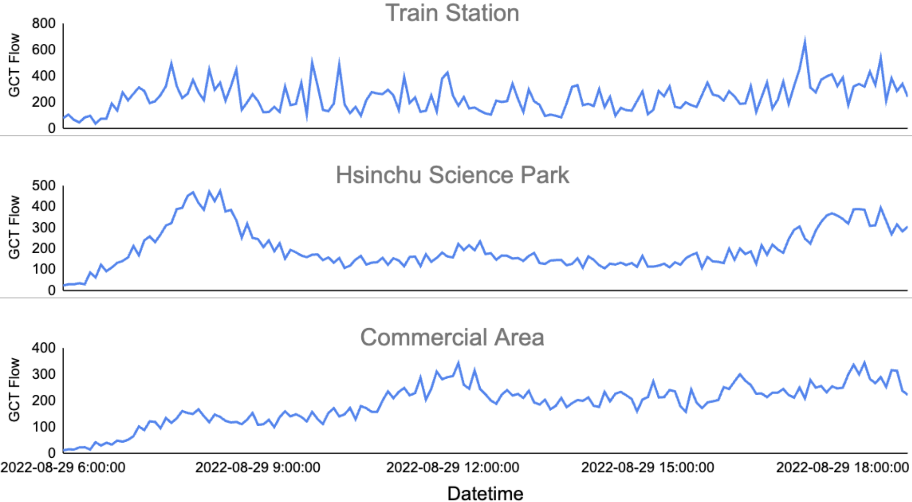
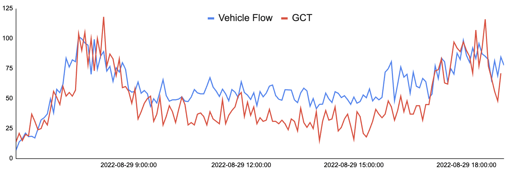
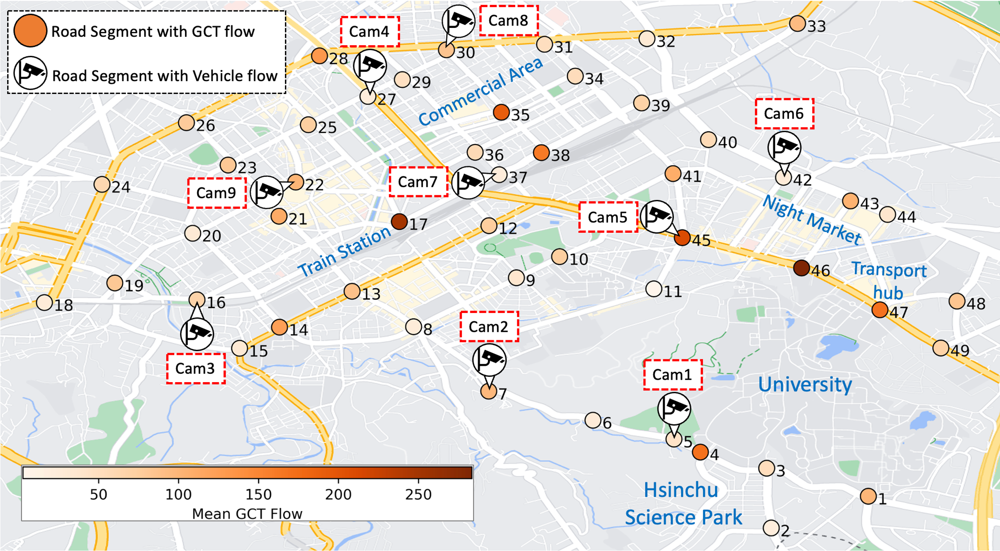

# Tel2Veh (Telcom Data 2(to) Vehicle Flow) Dataset
This is the original data repository of Tel2Veh
This prototypical dataset cooperated with [Chunghwa Telecom laboratories](https://www.chttl.com.tw/en/index.html)

#### Tel2Veh contains two type flows: 49 GCT (Geographical Cellular Traffic) and 9 camera-detected vehicle flows

## Demo 

Demo Page: https://cylin-gn.github.io/Tel2Veh-demo


## Task Supported by Tel2Veh


#### We aim to utilize sparse vehicle flows to enhance cellular traffic for predicting camera-free area flow via our framework.


The dataset is provided at:
```
./Data
```

Experimental code is provided at:
```
./Model
```

## Overview

### GCT

GCT is cellular traffic with estimated GPS coordinates obtained from triangulation, indicating where the traffic was generated. 

Here are the partial examples of GCT records (*IMEI numbers were hashed to protect privacy):

|       Time     |    IMEI        |    Longitude   |      Time      |    
|:--------------:|:--------------:|:--------------:|:--------------:| 
|       ...      |    ...         |    ...         |    ...         |  
|     07:30:36   |    H...aK      |   24.78711     |   120.98641    |
|     07:31:02   |    B...EQ      |   24.78702     |   120.98664    |
|     07:31:07   |    M...Gn      |   24.78703     |   120.98642    |
|       ...      |    ...         |    ...         |    ...         | 

### GCT Flow
We define GCT flow as the total quantity of GCT within a fixed interval (e.g., 5 minutes) using public traffic flow datasets.

Below are partial examples of GCT flows from areas near different regional functionality:



### Vehicle Flow
We deploy six cameras on a road segment with GCT flow to collect vehicle flow as a supplement for refining GCT flow. 
We define the total quantity of detected vehicles within a fixed interval (e.g., 5 minutes) as the vehicle flow.

Here is an example of the **GCT flow vs Vehicle Flow** for one road segment near Hsinchu Science Park:


* Enhancement for Vehicle Flow Counting *
Considering Taiwan’s distinctive traffic conditions, such as dense motorcycle traffic, we fine-tuned YOLOv7 and FastReID, used in BOT-Sort, with over 1,000 manually labeled instances for robust detection accuracy. As displayed on the left side of the following figure, these modifications improved the models’ detection, thereby enhancing tracking capabilities under various conditions. The right side of the following figure demonstrates the accuracy of detection and tracking.


### Road segment
The road segments are defined as 20m x 20m areas, which is based on the average road size in our proof-of-concept (POC) area in Hsinchu, Taiwan. 
All the GCTs listed in the above table are located within the predefined road segments, nearby various regional functionality.

Six road segments are selected for deploying camera for collecting vehicle flow.

Here are the distribution examples of selected road segments:



## Experimental Materials Providing 

### I. Graph Structure of Road Segments Network

We provide instructions on how to construct a road segment network in the Hsinchu POC area:

Graph structure construction: To generate the graph structure based on the **..._Distance.txt** file provided below, please follow the [script](https://github.com/liyaguang/DCRNN/blob/master/scripts/gen_adj_mx.py). 

#### GCT Flow
- [GPS coordinates for each road segment ID](./Data/Raw/GCT_Location.csv)
- [Distance between connected road segments (in meters)](./Data/Raw/GCT_Roads_Distance.txt)
- [road network structure file](./Data/hsin_49_GCT_0600_1900_rename/adj_mat_49_corrected.pkl)


#### Vehicle Flow
- [GPS coordinates for each road segment ID](./Data/Raw/Vehicle_Flow_Location.csv)
- [Distance between connected road segments (in meters)](./Data/Raw/Vehicle_Flow_Roads_Distance.txt)
- [road network structure file](./Data/hsin_9_CCTV_0600_1900_rename/adj_mat_9.pkl)

### II. Tel2Veh dataset used for training

Tel2Veh comprises GCT flow and vehicle flow. The Data Structure of Tel2Veh is shown as follows:

|        Date         | Road Segment 1 | ...  | Road Segment 49 | Cam1 | ... | Cam9 | 
|:-------------------:|:--------------:|:--------------:|:--------------:|:--------------:|:--------------:|:--------------:|
|         ...         |    ...         |    ...         |    ...         |    ...        |    ...        |    ...        |
| 08-28 18:55 |  81        |  ...        |   228        |    151         |    ...        |   158        |
| 08-28 19:00 |  50        |  ...        |   186        |    138         |     ...        |   177        |
| 08-29 06:00 |  20        |  ...         |   31        |    38         |    ...        |   14        |
|         ...         |    ...         |    ...         |    ...         |      ...        |   ...        |

- The original CSV file for GCT flow is available at: [GCT flow.csv](./Data/Raw/GCT_Flow.csv)
- The original CSV file for Vehicle flow is available at: [Vehicle flow.csv](./Data/Raw/Vehicle_Flow_Raw.csv)
- To generate the **train/val/test datasets** for each type of GCT flow as {train,val,test}.npz, please follow the [script](https://github.com/liyaguang/DCRNN/blob/master/scripts/generate_training_data.py),
using the CSV files provided above.

The **processed train/val/test data structures file** are available, 
- data structures file for GCT flow: [Here](./Data/hsin_49_GCT_0600_1900_rename)
- data structures file for Vehiclw flow: [Here](./Data/hsin_9_CCTV_0600_1900_rename)

### III. Model Zoo

Download and store the trained models in 'pretrained' folder as follow:

```
./Model/save
```
Here is the saved model of GWNET: the first two are pre-trained for feature extraction, while the last one is trained for predicting vehicle flow in stage 2.
- Pretrained for GCT Flow Feature Extraction (STGNN-1): [exp202312151449_0.pth](https://github.com/cylin-gn/Tel2Veh/blob/main/Model/save/exp202312151449_0.pth)
- Pretrained for Vehicle Flow Feature Extraction (STGNN-2):" [exp202301041709_0.pth](https://github.com/cylin-gn/Tel2Veh/blob/main/Model/save/exp202401251640_0.pth)
- Trained for Fusion & Third-STGNN (STGNN-3): [exp202401251640_0.pth](https://github.com/cylin-gn/Tel2Veh/blob/main/Model/save/exp202401251640_0.pth)


For model code and training, please see:
```
./Model
```

### Example of Integrating STGNN([Graph Wavenet (GWNET)](https://github.com/nnzhan/Graph-WaveNet)) into the Framework for Prediction: We exclude this vehicle flow during training to simulate a camera-free scenario.


